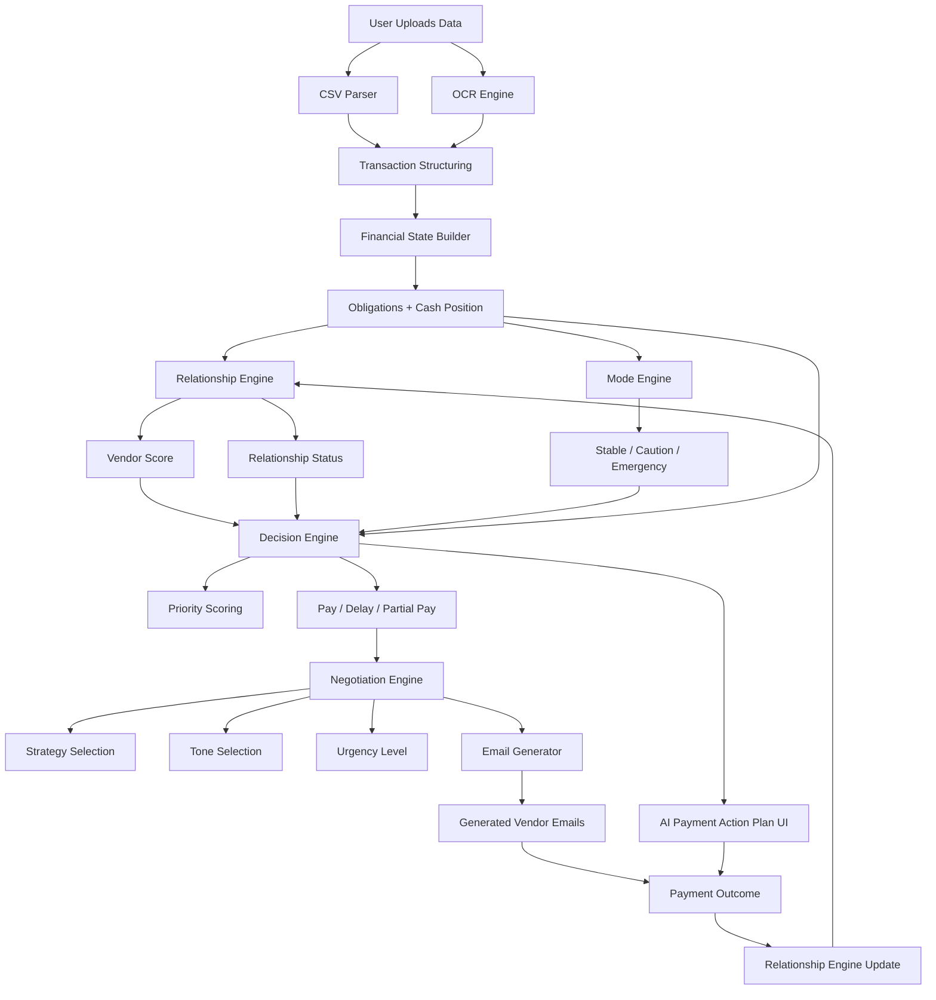

# Project Floater — Intelligent Cashflow & Payment Decision System

## 📌 Overview

Project Floater is an AI-powered financial decision engine designed for small businesses to intelligently manage cash flow, prioritize payments, and maintain vendor relationships.

It goes beyond simple accounting by combining financial analysis with relationship intelligence and automated negotiation strategy.

---

## 🎯 Problem Statement

Small businesses often operate under tight cash constraints. When funds are insufficient, deciding **who to pay, delay, or negotiate with** becomes complex and risky. Poor decisions can lead to service interruptions or damaged reputations with key suppliers.

---

## 💡 Solution

Project Floater analyzes financial obligations and produces an **AI Payment Action Plan** that:

* Ranks payments by priority (0.0 to 1.0)
* Suggests actions (pay / delay / partial pay)
* Adapts based on real-time **Vendor Relationship Health**
* Generates context-aware negotiation emails automatically using **LLaMA 3**

---

## 🧠 Core Features

### 1. 📥 Multi-Source Data Ingestion
* **OCR Engine**: Image-to-JSON parsing for receipts and invoices via Python-based OCR logic.
* **Financial Syncing**: Integrates current balance and historical transaction data.

### 2. 🧮 Intelligent Priority Engine
* Calculates priority using normalized metrics:
  * **Urgency**: Proximity to due date (overdue items are ranked highest).
  * **Penalty Risk**: Weight of late fees.
  * **Flexibility**: Inverse mapping (low flexibility = high priority).
  * **Relationship Importance**: Strategic value of the partner.
  * **Cash Impact**: Percentage of available funds required.

### 3. 🤝 Relationship Intelligence
* **Dynamic Trust Scoring**: Tracks vendor interactions (on-time vs. late payments).
* **Classification**:
  * 🟢 **Strong**: High leverage, safe to negotiate extensions.
  * 🟡 **Stable**: Standard standing, moderate flexibility.
  * 🔴 **Sensitive**: High friction risk, prioritize immediate payment.

### 4. 💬 AI Negotiation & Outreach
* **Negotiation Engine**: Determines the optimal strategy (Friendly / Professional / Formal) based on vendor standing.
* **AI Mail Generation**: Uses **LLaMA 3 (via Ollama)** to draft ready-to-send emails that protect relationships while preserving cash.

### 5. 🛡️ Trust-Based Leverage Analysis
* **AI Leverage Report**: Strategic assessment of your entire network to determine how much "Extension Power" you have before triggering critical friction.

---

## 🔄 System Flow (Detailed)



---

## 🛠️ Tech Stack

* **Frontend**: React (Vite) + Tailwind CSS + Lucide Icons
* **Backend**: Node.js (Express) + Nodemon
* **Database**: Supabase (Auth & Storage)
* **AI Models**: LLaMA 3 (via Ollama)
* **Core Logic**: Python (OCR & Scoring Alt-Engines)

---

## ⚙️ Getting Started

### 1. Prerequisites
* **Ollama**: Must be running locally with the `llama3` model pulled.
  ```bash
  ollama run llama3
  ```
* **Python**: Required for OCR and secondary scoring modules.

### 2. Installation
1. Clone the repository.
2. Install root dependencies:
   ```bash
   npm install
   ```
3. Install frontend and backend dependencies:
   ```bash
   cd frontend && npm install
   cd ../backend && npm install
   ```
4. Configuration:
   Create a `.env` file in the `backend/` directory with your Supabase credentials (or use dummy mode).

### 3. Running the App
Run the full system concurrently from the root:
```bash
npm run dev
```

---

## 🏁 Conclusion

Project Floater transforms chaotic financial decision-making into a structured, intelligent, and automated process — helping small businesses survive and scale with confidence by leveraging AI for strategic communication and trust-based prioritization.
